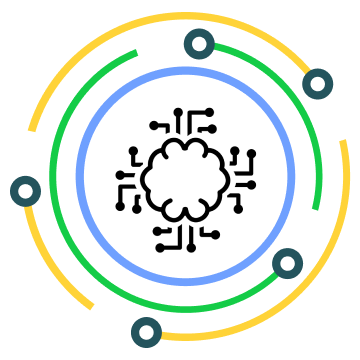

## Hi there 👋 greetings from LSN Solutions

LSN Solutions aims to provide all-around solutions to your technical problems. It will include sample POCs on various day-to-day problems from a technology perspective. These will include but not limited to:

1. Node
2. Python
3. HTML
4. CSS
5. SCSS
6. Bootstrap
7. Angular
8. Arduino
9. Raspberry Pi
10. Blue Pill STM-32
11. Java
12. C
13. React
14. Git
15. Github
16. Firebase
17. MongoDB
18. WSL
19. Linux
20. Android
21. Gradle
22. Yarn
23. Jenkins
24. Bitbucket
25. Javascript
26. SQL
27. No SQL
28. Google Cloud
29. AWS
30. Kubernetes

These are, to begin with, and will include more as we progress further down.

We are open to collaborating with like-minded people and providing POCs and solutions to various problems in day-to-day life pertaining to technology.

[Connect with us](mailto:contact.lsnsol@lurisan.in)

